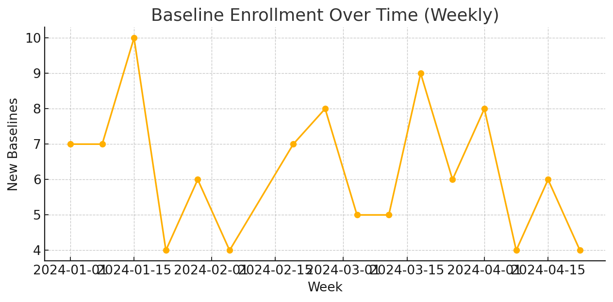

[](<YOUR_STREAMLIT_URL>)

## Live Demo
- Dashboards (Streamlit): <project-data-manager-portfolio-nygbtjk8t4w8fspewwgxct.streamlit.app>
- Landing Page (GitHub Pages): https://rkanap200.github.io/project-data-manager-portfolio/
- eCRFs (direct links):
  - DM: https://rkanap200.github.io/project-data-manager-portfolio/ecrfs_html/DM.html
  - SV: https://rkanap200.github.io/project-data-manager-portfolio/ecrfs_html/SV.html
  - VS: https://rkanap200.github.io/project-data-manager-portfolio/ecrfs_html/VS.html
  - AE: https://rkanap200.github.io/project-data-manager-portfolio/ecrfs_html/AE.html
  - CM: https://rkanap200.github.io/project-data-manager-portfolio/ecrfs_html/CM.html
  - LB: https://rkanap200.github.io/project-data-manager-portfolio/ecrfs_html/LB.html
  - QRY: https://rkanap200.github.io/project-data-manager-portfolio/ecrfs_html/QRY.html
# Clinical Portfolio Sample (eCRFs + Dashboards)

This repo showcases a miniature clinical data management portfolio:
- **eCRF Schemas** (JSON) inspired by CDASH for common domains
- **Synthetic Trial Data** (CSV) for 100 subjects across 3 sites
- **Static eCRFs** (HTML/JS) that save responses to your browser (localStorage) for demo
- **Streamlit Dashboards** to explore KPIs (queries, enrollment, AE rates, lab flags)

## Quick Start

### Option A: View eCRFs (static)
Open the HTML files in `ecrfs_html/` directly in your browser. Submissions are stored in localStorage only (no server).

### Option B: Run dashboards
```bash
pip install -r requirements.txt
streamlit run app/streamlit_app.py
```
Then open the local URL shown by Streamlit.

## Contents
```
data/                  # synthetic CSVs
ecrf_schemas/          # JSON schemas for each eCRF
ecrfs_html/            # static demo eCRFs
app/                   # Streamlit dashboard app
sql/                   # PostgreSQL DDL (tables + basic constraints)
```

## Notes
- All data are **synthetic** and randomly generated.
- Schemas loosely align with CDASH naming conventions but are simplified for portfolio demonstration.
- The static forms are intentionally simple and front-end only; in real studies, an EDC back end, audit trail, and role-based access are required.


## Portfolio Branding
**Author:** Ragha Sudhir Kanaparthi — PMP-certified Clinical Data Manager  
**Location:** Berlin, Germany  
**Tools used:** Streamlit, Python, pandas, numpy, (Power BI/Spotfire in professional roles)


## Gallery (Static Previews)




